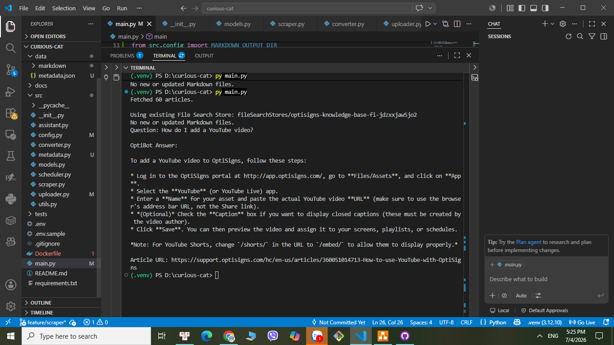

# Curious Cat – OptiSigns Knowledge Base Assistant
A mini RAG system that scrapes the OptiSigns Help Center, detects article changes, indexes Markdown documents into Gemini File Search Store, and answers user questions using Retrieval-Augmented Generation (RAG).

## Setup

### Requirements
- Python 3.10+
- Docker
- Gemini API Key

### Configurations
Copy `.env.example` to `.env` and set:

```env
GEMINI_API_KEY=<your_api_key>
```

## Chunking Strategy
- Each Help Center article is converted into one Markdown document.
- Documents are uploaded directly to Gemini File Search Store.
- Chunking and embedding are automatically handled by Gemini File Search during indexing.
- Delta detection uses each article's `updated_at` timestamp to upload only new or modified articles.

## Repository Structure
- `main.py`: Scrape, detect deltas, convert to Markdown, and upload to Gemini File Search Store.
- `chat.py`: Interactive Q&A using Gemini File Search.

## Run Locally

### Option 1. Python
```bash
pip install -r requirements.txt
python main.py
python chat.py
```

### Option 2. Docker
Build image:

```bash
docker build -t curious-cat .
```

Run scraper:

```bash
docker run -e GEMINI_API_KEY=.. -e MAX_PAGES=3 curious-cat   

```
or

```bash
docker run -e --rm --env-file .env -v ./data:/app/data curious-cat 
```

Run interactive assistant:

```bash
python chat.py
```
## Daily Job Logs
The scraper is deployed on an Azure VM using Docker and scheduled to run daily via cron.

Daily log: http://57.155.2.144:8080/daily.log

## Sample Assistant Response
